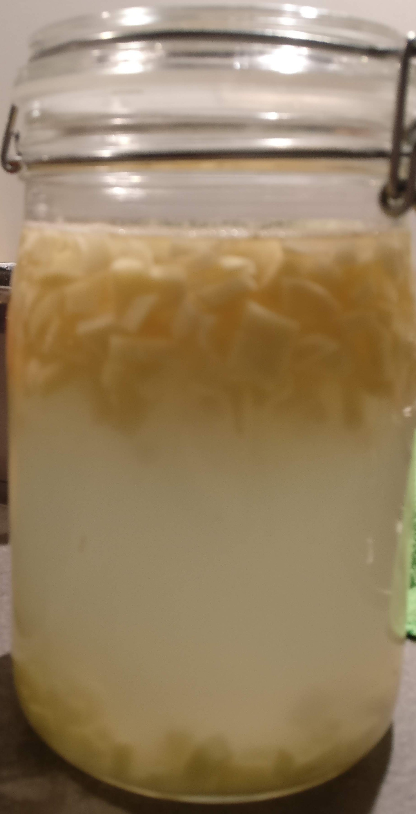
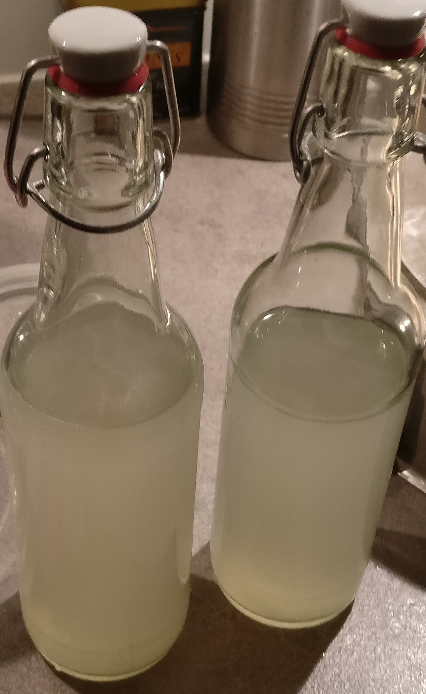

# Ginger Beer

## Attempt One -- One Off (2020-11-03)

Inspired by: [It's alive](https://www.youtube.com/watch?v=RXAEN8MP8N4)

Scaled to roughly these rations relative to amount of water:
* 20% Ginger
* 15% Sugar

### Ingredients

* 800ml Water
* 150g ginger (peeled, chopped)
* 120g suger

### Notes

* Bottled on 2020-11-08
* Done 2020-11-11, moved to fridge
* Could have more ginger taste
* Carbonated very quickly

## Attempt Two -- One off (2020-11-11)

### Ingredients

* 750ml water
* 250g ginger (peeled, chopped)
* 80g white sugar
* 20g brown sugar
* 20g honey (because why not)

### Notes

* Ginger took more volume than expected, ginger to water ratio probably off

## Attempt Three -- Ginger Bug (2020-11-11)

Inspired by:

* [Fairment Ginger Bug](https://www.fairment.de/wissen/ingwerbier-ginger-beer/)
* [Joshua Weissmann](https://www.youtube.com/watch?v=LqPko6a3Wh4)

### Ingredients

* 50g ginger (unpeeled, grated)
* 900ml water
* 80g honey (because why not)
* 20g brown sugar
* 50g ginger bug
* juice of 4 limes
* juice of 1 lemon

### Notes

* More ginger than suggested
* The tea was very spicy before fermentation
* jar a bit too full, reduce by 100ml next time
