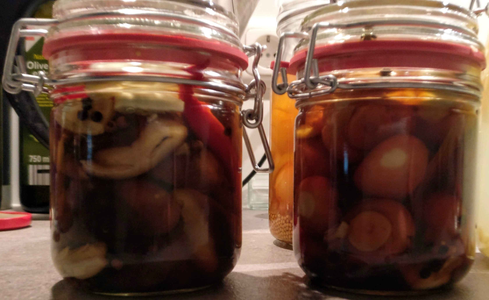

# Pickled Mushrooms

## Attempt One (2020-11-03)

Inspired by: [Easy pickled mushrooms](https://momsdish.com/recipe/336/pickled-mushrooms)

### Ingredients

#### Pre cooking:

* 200g of mushrooms (champignons/shiitake)
* 100ml vinegar
* Water to cover mushrooms

#### Marinade

Cooked part
* 500ml water
* 2 bay leaves
* 1tbsp salt
* a few peppercorns

Added to the jar
* 1 habanero
* 1 chili pepper
* mustard seeds
* 2 cloves of garlic
* 1/4 onion

### Notes

